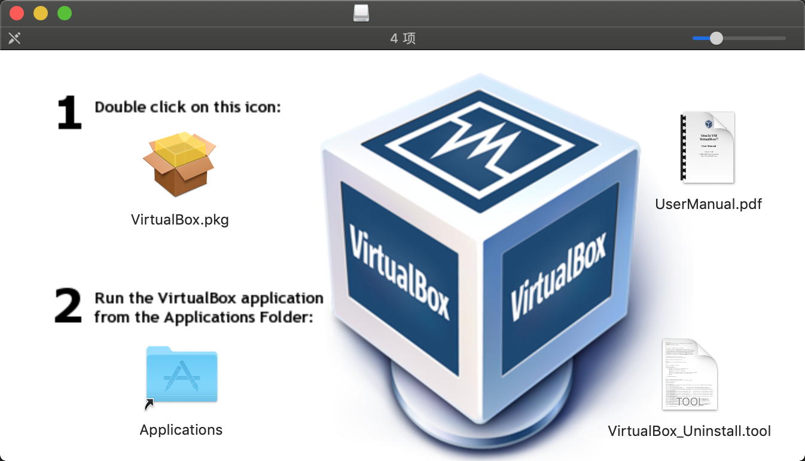
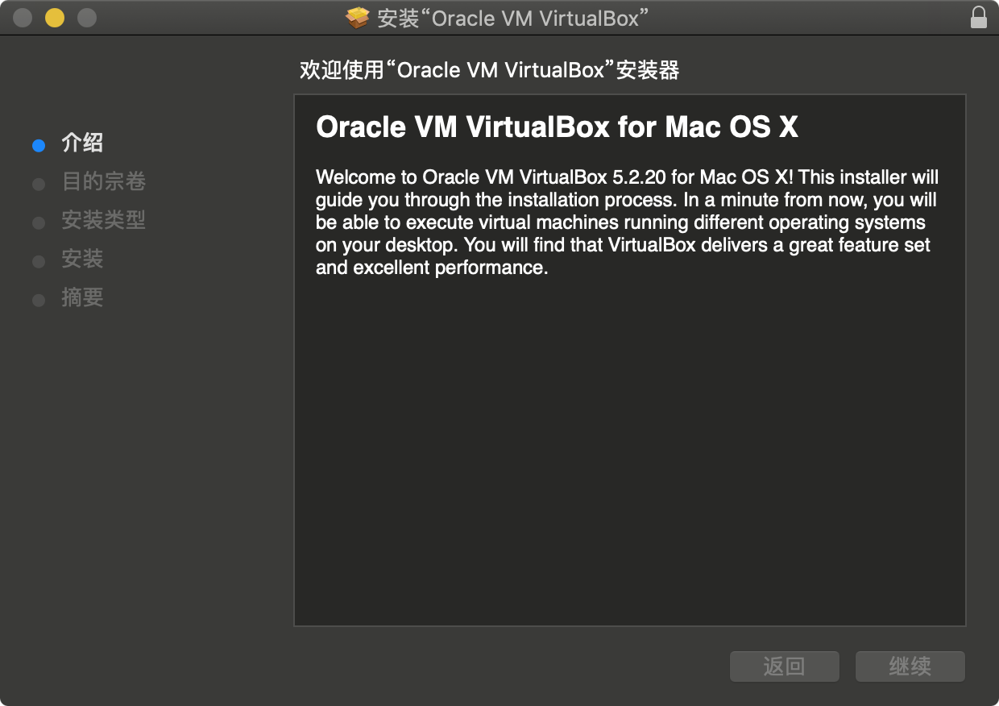
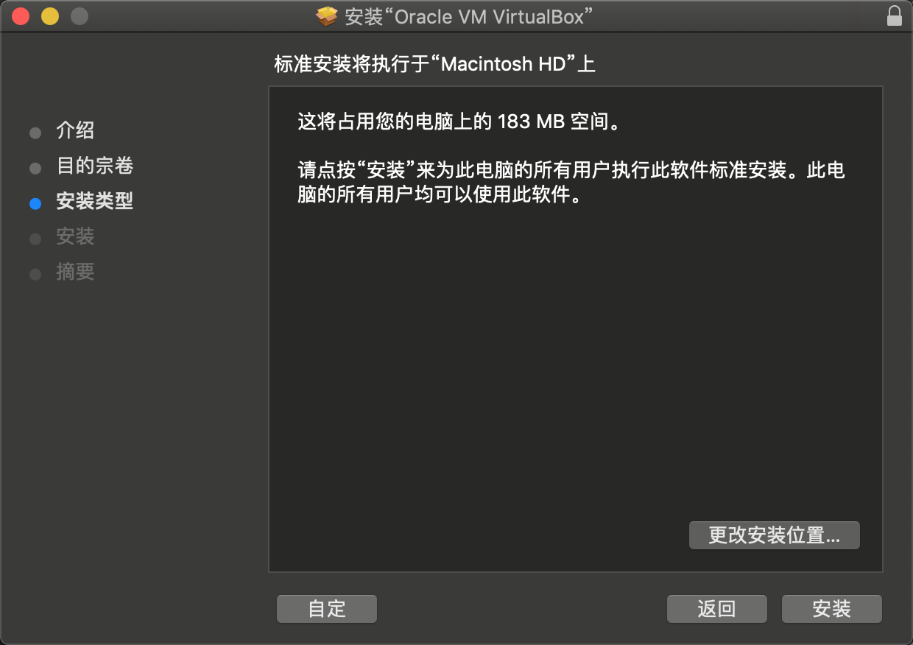
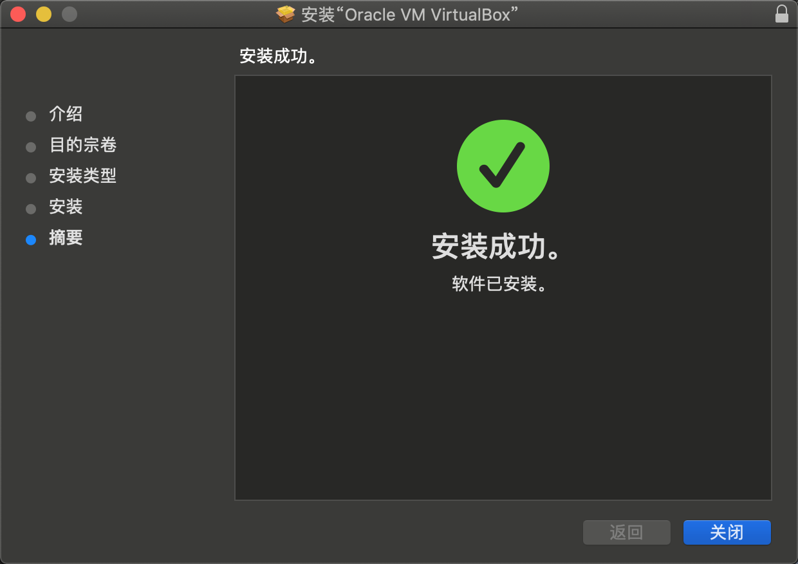
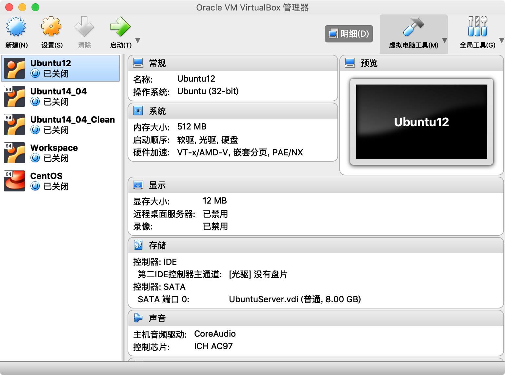
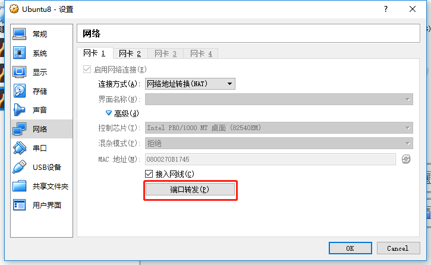
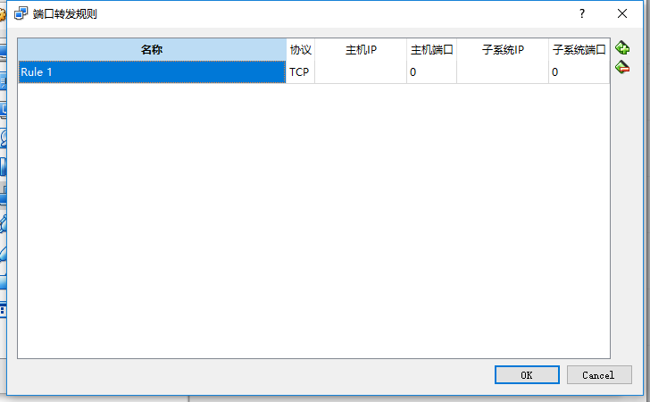
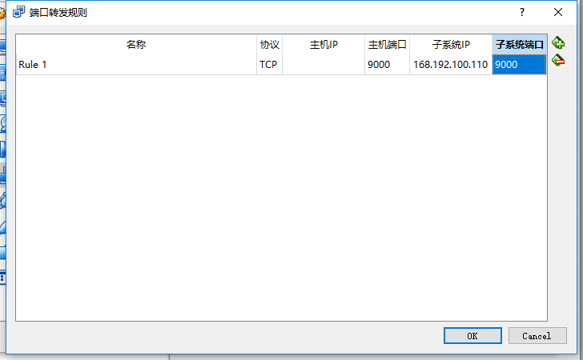

安装虚拟机软件。

虚拟机软件有很多种，这里使用 VirtualBox 作为主要工具。

# 1 下载 VirtualBox

从 [VirtualBox 官网](https://www.virtualbox.org/wiki/Downloads) 下载对应平台的安装包。

# 2 安装 VirtualBox

# 3 接口穿透

NAT模型,点击高级,端口转发

选择子系统ip(虚拟机IP)

映射端口号,最好端口号对应,方便记录

