配置 Ubuntu 网络环境。

在公司等企业网中，一般不使用 DHCP 自动获取 IP 地址，所以一般虚拟机创建后会有无法联网的问题。

如果使用 NAT 方式，则又无法从主机链接到虚拟机环境。

所以这里推荐增加一个网卡，并使用 Host-Only（主机网络）方式进行主机和虚拟机之间链接。

# 1 创建主机网络

1. 关机已经打开的虚拟机；

2. 全局工具，选择主机网络管理器；

   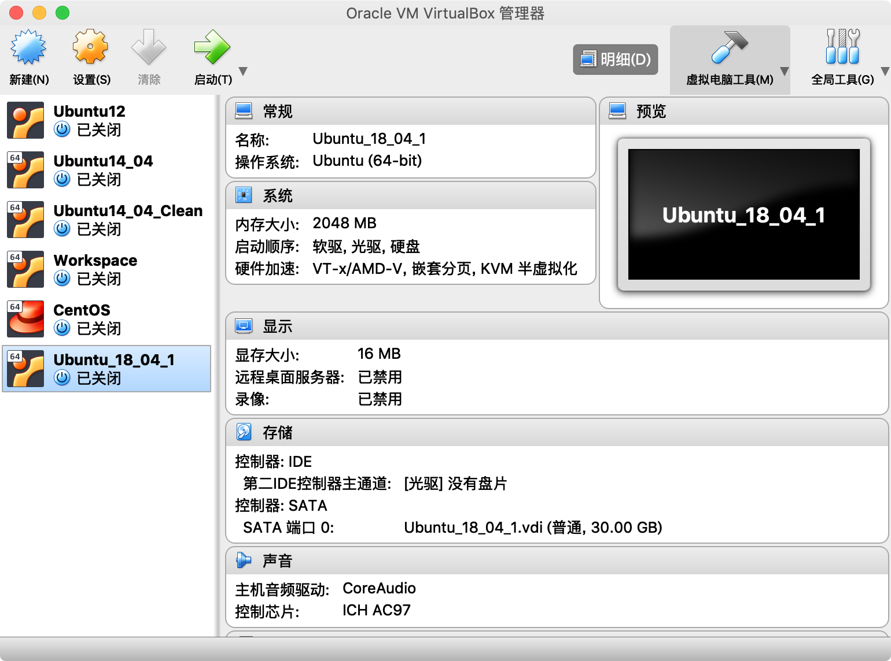

3. 创建主机网络；

   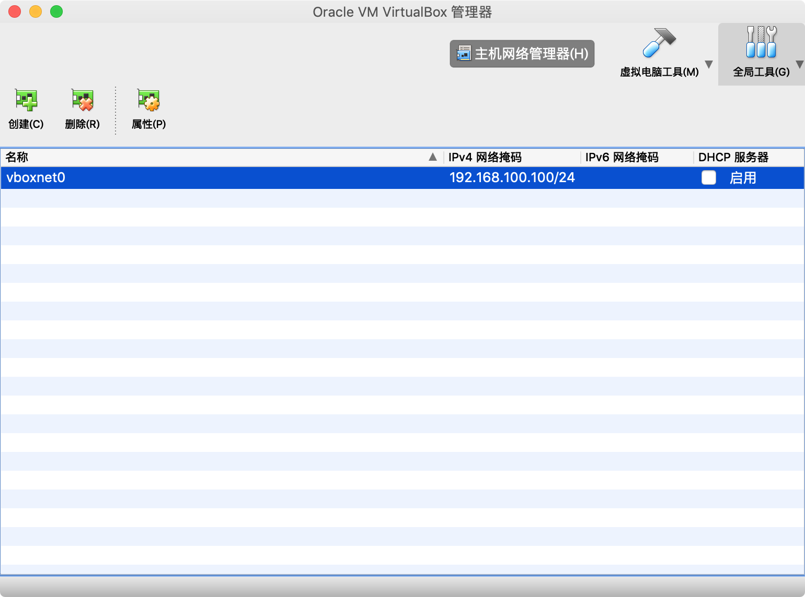

4. 修改主机网络属性；

   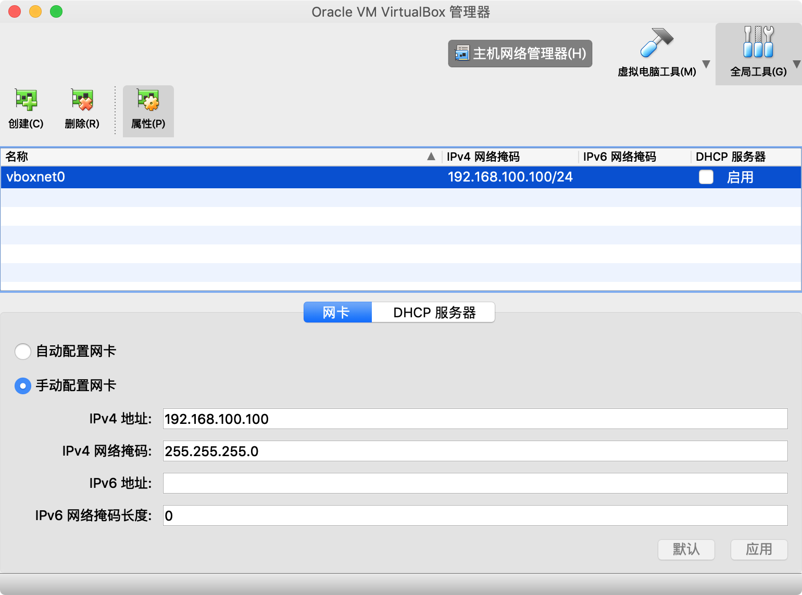

# 2 配置服务器网卡

1. 选择需要配置的服务器，并点击设置；

   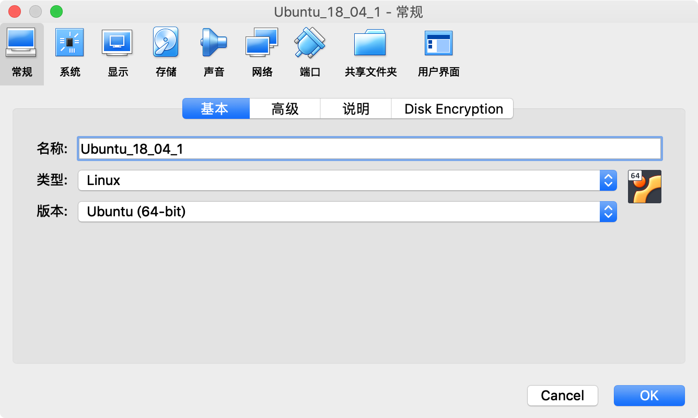

2. 在网络中，点击网卡 2，进行以下设置；

   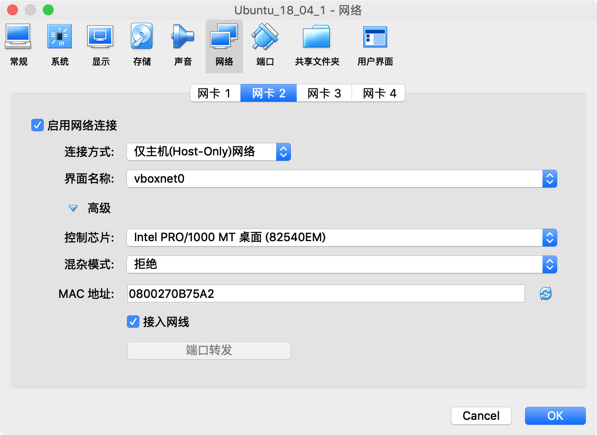

# 3 配置服务器网络

1. 启动服务器并登陆；

   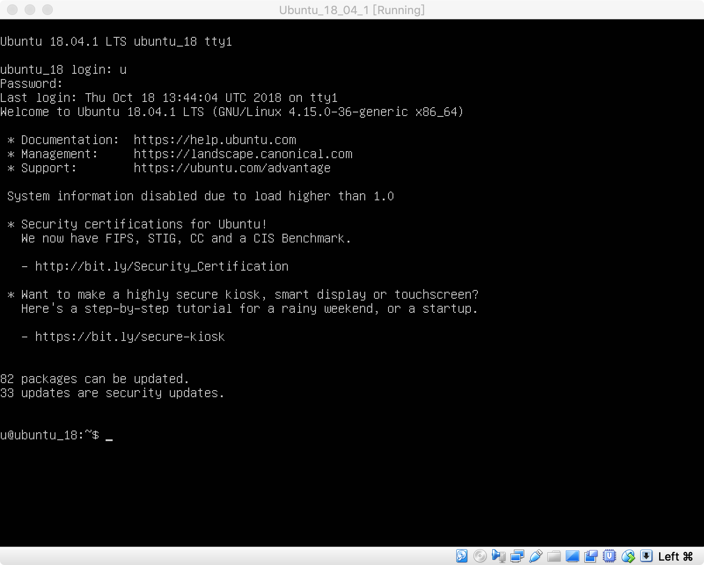

2. 查看当前网卡的信息，这里新增的网卡为 `enp0s8`；

   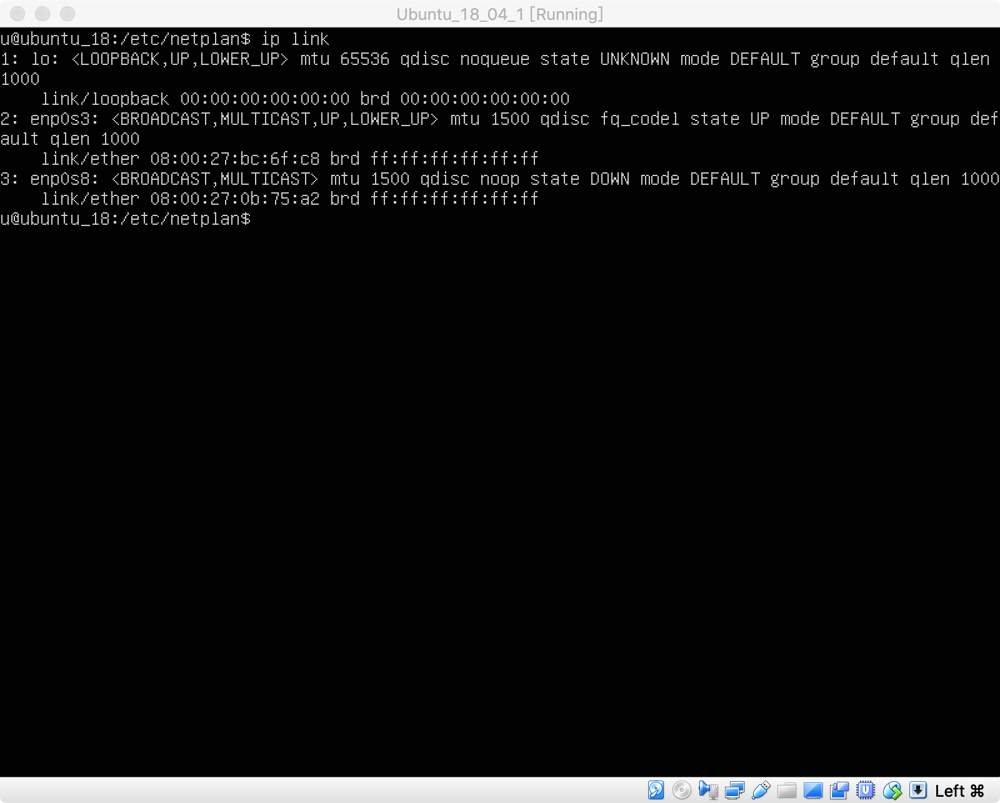

3. 进入 `/etc/netplan` 目录，并打开编辑 `50-cloud-init.yaml` 文件；

   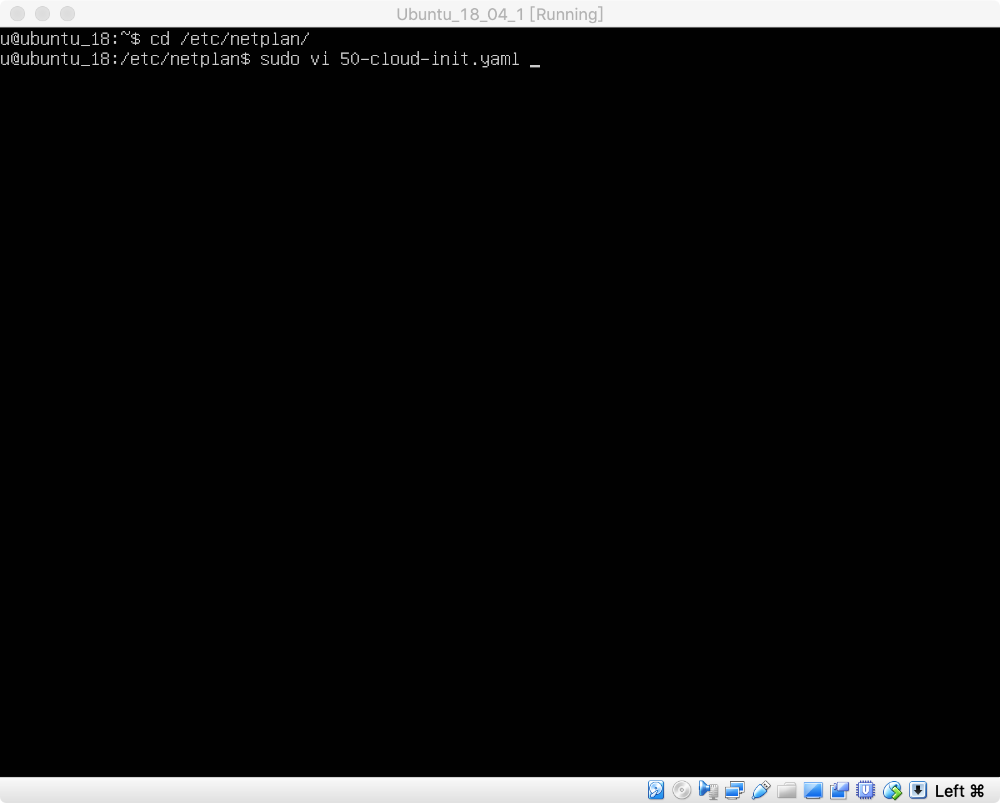

4. 输入以下配置内容，保存关闭；

   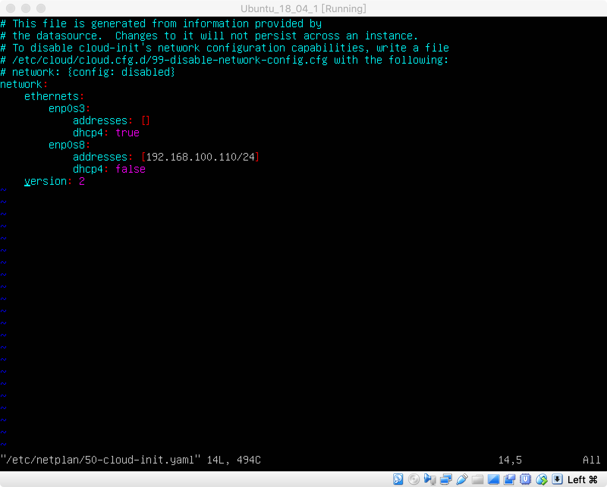

5. 更新网络配置，并查看；

   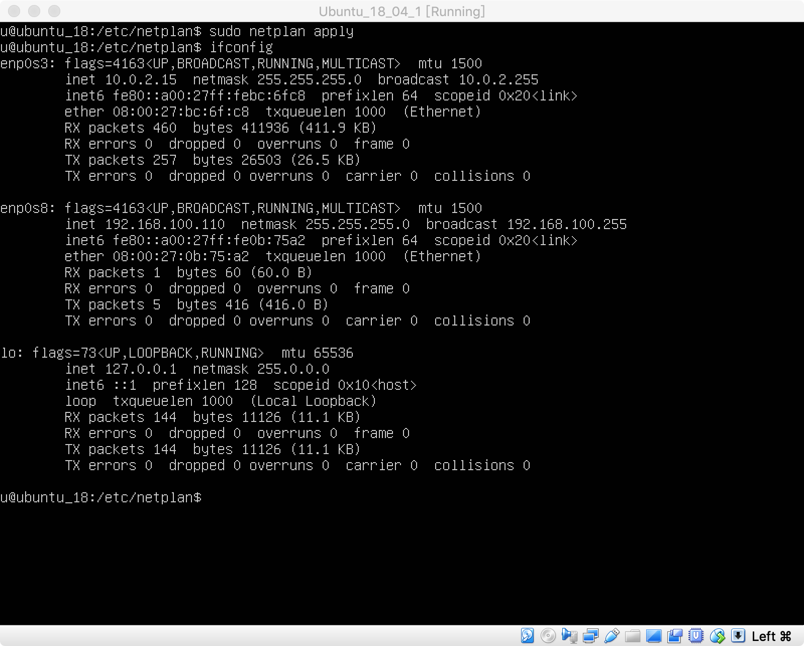

6. 测试网络；

   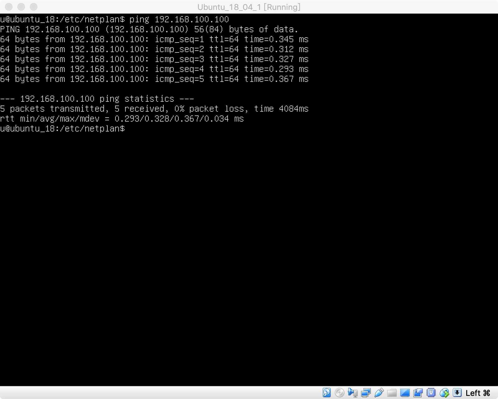