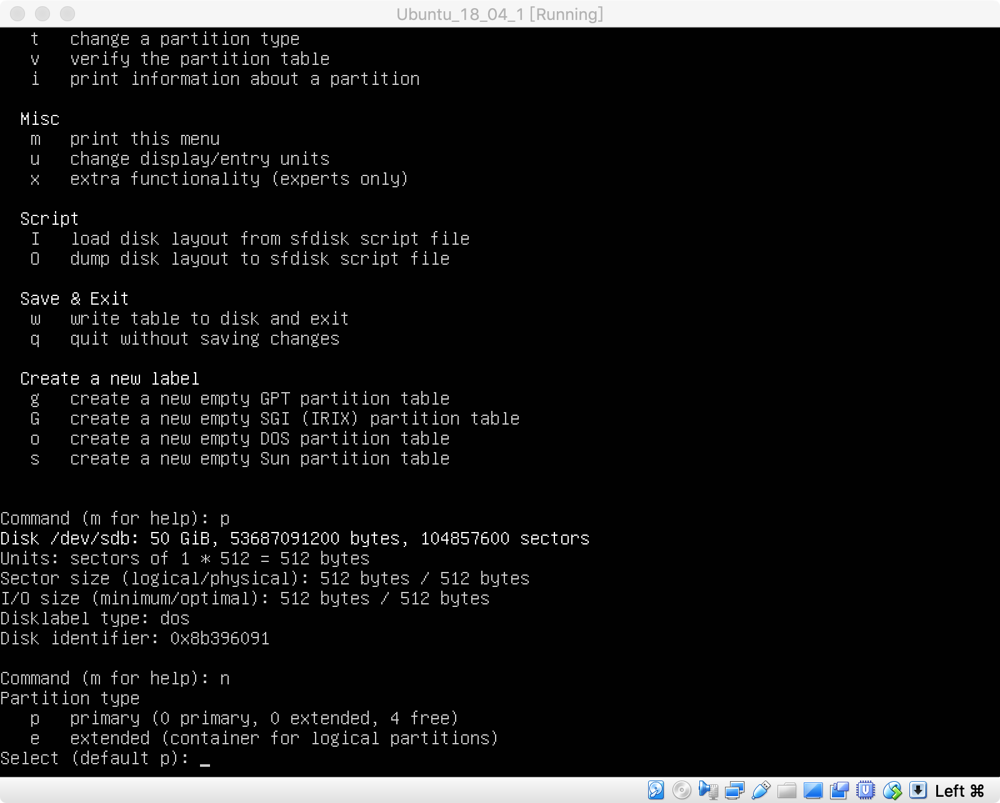

安装系统时，设置的硬盘较小，另外一般工作环境，也不会与系统环境放在一起，所以我们通过挂载磁盘方式，增加磁盘空间，并设置工作环境。

# 1 创建虚拟硬盘

1. 关机已经打开的虚拟机；

2. 点击设置，并进入存储页面，并选择添加虚拟硬盘；

   

3. 选择创建新的虚拟盘；

   

4. 选择类型，并继续；

   

5. 选择分配模式，并继续；

   

6. 选择存储位置，并调整大小，点击创建；

   

7. 创建成功；

   

# 2 磁盘分区

1. 开机并登录系统；

   

2. 查看当前磁盘信息；

   

3. 操作对应的磁盘，输入 m 查看帮助；

   

4. 支持的磁盘操作；

   

5. 输入 p，查看当前分区；

   

6. 输入 n，创建分区，选择主分区还是扩展分区，默认主分区；

   

7. 选择磁盘分区在该硬盘中的序号；

   

8. 磁盘起始位置；

9. 磁盘结束位置；

10. 创建分区结束，按 p 显示分区信息；

11. 输入 w，保存并退出；

    

# 3 格式化分区

1. 格式化创建的分区，并等待格式化完成；

   

# 4 挂载硬盘

1. 创建 `/data` 目录；

   

2. 挂载硬盘到 `/data` 路径下；

   

# 5 开机自动挂载硬盘

1. 编辑 `/etc/fstab` 文件；

   

2. 在文件中，追加以下内容；

   

3. 保存并退出；