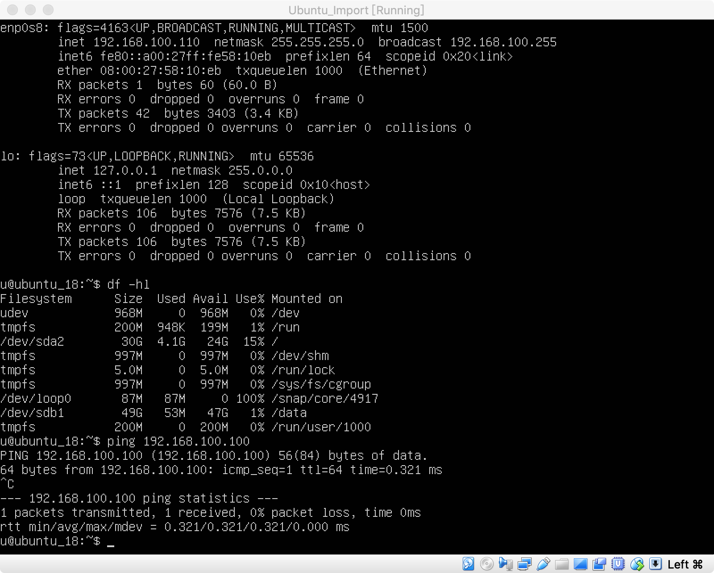

虚拟机系统需要在办公室和家里同时使用时，可以将虚拟机文件，拷贝到移动硬盘上，在虚拟机上以该文件创建环境即可。

# 1 创建虚拟机

1. 点击新建，创建虚拟机，填写名称等信息。选择使用已有的虚拟硬盘文件，并选择对应的硬盘文件，点击创建；

   

2. 选择刚创建的虚拟机，并点击设置；

   

3. 修改网络配置，添加 Host-Only 模式；

   

4. 修改存储配置，添加之前创建的虚拟磁盘；

   

5. 开机并登陆，检查网络和磁盘状态；

   

