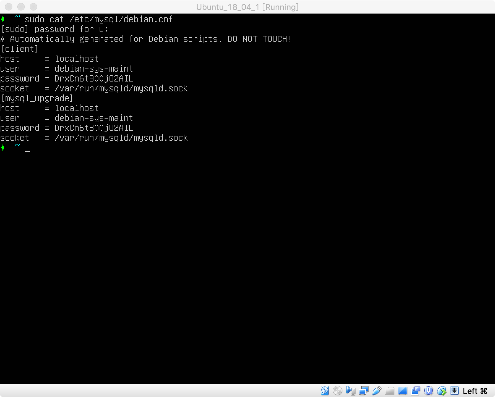
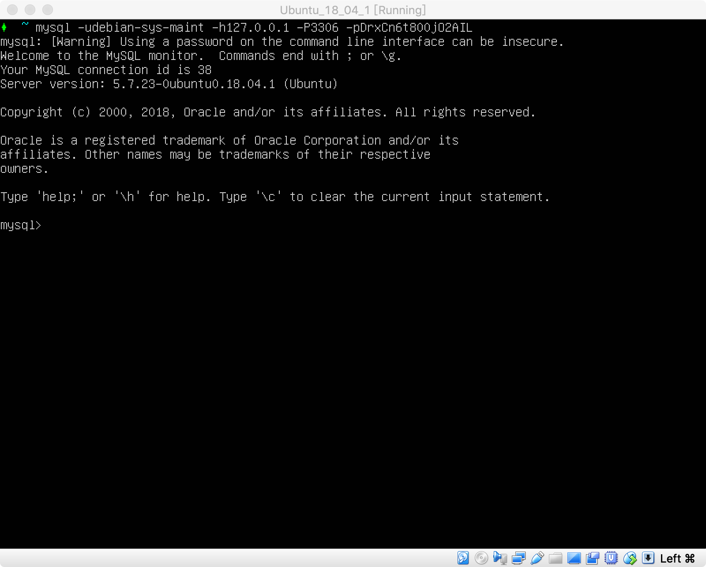
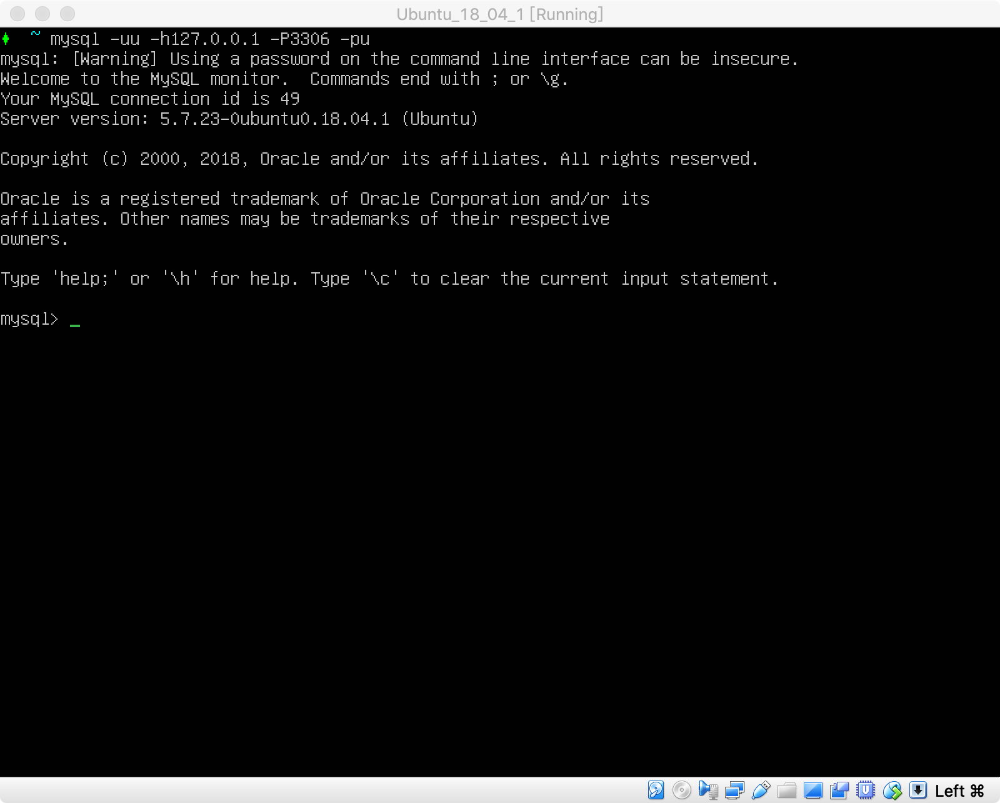

MySQL 所使用的 SQL 语言是用于访问数据库的最常用标准化语言。MySQL 软件采用了双授权政策，分为社区版和商业版，由于其体积小、速度快、总体拥有成本低，尤其是开放源码这一特点，一般中小型网站的开发都选择 MySQL 作为网站数据库。

# 1 安装 MySQL

1. 执行以下命令，安装 mysql；

   ``` sh
   sudo apt install mysql-server
   ```

2. 查看初始用户名密码；

   ``` sh
   sudo cat /etc/mysql/debian.cnf
   ```

   

3. 登录数据库；

   ``` sh
   mysql -udebian-sys-maint -h127.0.0.1 -P3306 -pDrxCn6t800jO2AIL
   ```

   

4. 创建用户，并设置密码；

   ``` mysql
   GRANT ALL ON *.* TO 'u'@'127.0.0.1' IDENTIFIED BY 'u';
   ```

5. 退出并用创建的新用户登录；

   ``` sh
   mysql -uu -h127.0.0.1 -P3306 -pu
   ```

   

# 2 外网访问权限

MySQL 安装后，默认情况下只能本机访问，如果需要其他机器的访问权限，需要以下步骤。

1. 设置绑定地址；

   ``` sh
   # 1. 编辑配置文件；
   sudo vi /etc/mysql/mysql.conf.d/mysqld.cnf
   
   # 2. 修改 bind-address 为 0.0.0.0
   bind-address            = 0.0.0.0
   
   # 3. 保存退出;
   # 4. 重启 MySQL 服务；
   sudo service mysql restart
   
   # 5. 检查绑定地址是否正确；
   sudo netstat -antp | grep mysql
   
   # 6. 如果结果如下，则正确；
   # tcp        0      0 0.0.0.0:3306            0.0.0.0:*               LISTEN      3826/mysqld
   ```

2. 登录 MySQL，为对应访问用户开放权限；

   ``` sh
   # 1. 登录 MySQL；
   mysql -uu -h127.0.0.1 -P3306 -pu
   
   # 2. 假设要访问用户的 IP 为 192.168.1.100，用户名为 u，密码为 u；
   GRANT ALL ON *.* TO 'u'@'192.168.1.100' IDENTIFIED BY 'u';
   ```

# 3. 创建数据库

创建 HttpRunnerManager 需要的数据库。

1. 登录 MySQL；

   ``` sh
   mysql -uu -h127.0.0.1 -P3306 -pu
   ```

2. 创建名称为 HttpRunner 的数据库；

   ``` mysql
   CREATE DATABASE IF NOT EXISTS HttpRunner DEFAULT CHARACTER SET utf8 COLLATE utf8_general_ci;
   ```
