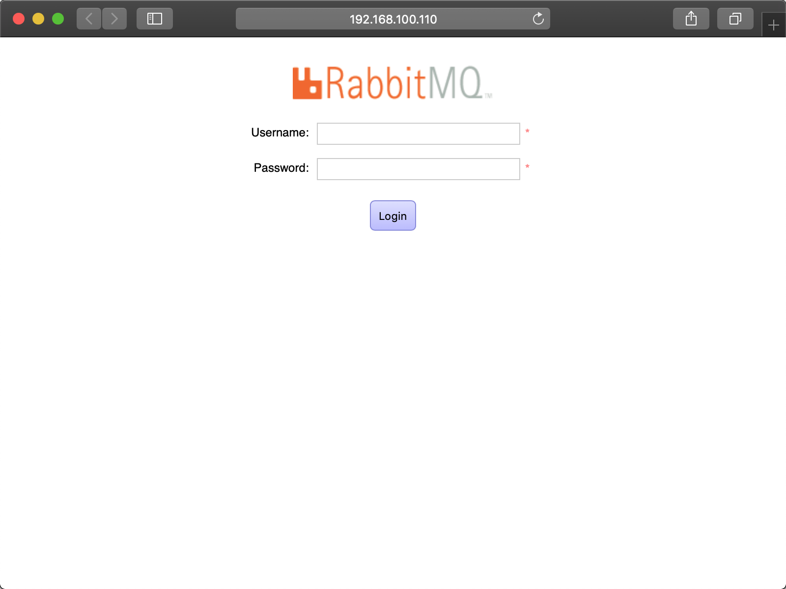

MQ 全称为 Message Queue（消息队列），是一种应用程序对应用程序的通信方法。

应用程序通过读写出入队列的消息（针对应用程序的数据）来通信，而无需专用连接来链接它们。消息传递指的是程序之间通过在消息中发送数据进行通信，而不是通过直接调用彼此来通信，直接调用通常是用于诸如远程过程调用的技术。排队指的是应用程序通过 队列来通信。队列的使用除去了接收和发送应用程序同时执行的要求。

RabbitMQ 是一个在 AMQP 基础上完成的，可复用的企业消息系统。

# 1 安装 RabbitMQ

1. 执行以下命令，安装 RabbitMQ；

    ``` sh
    # 1. 安装 RabbitMQ；
    sudo apt install rabbitmq-server
    
    # 2. 创建用户；
    sudo rabbitmqctl add_user u u
    
    # 3. 设置用户为管理员角色；
    sudo rabbitmqctl set_user_tags u administrator
    
    # 4. 设置用户权限；
    sudo rabbitmqctl set_permissions -p '/' u '.' '.' '.'
    
    # 5. 重启 RabbitMQ；
    sudo service rabbitmq-server restart
    ```

2. 打开浏览器，输入 `http://192.168.100.110:15672/` 进入管理界面；

    

3. 输入用户名和密码，进入管理系统；

   

