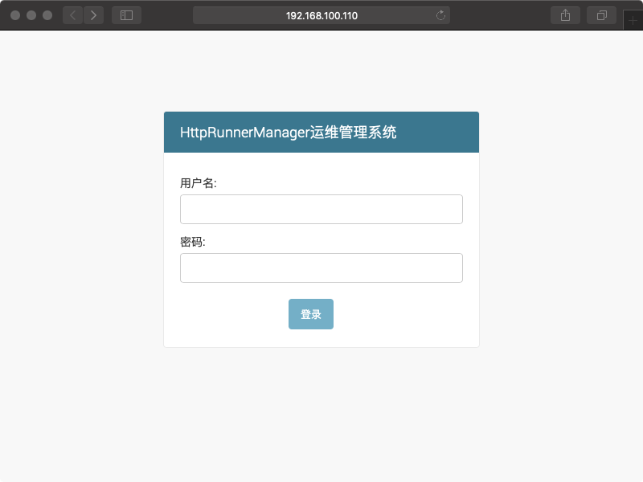

[HttpRunnerManager](https://github.com/HttpRunner/HttpRunnerManager) 是基于HttpRunner的接口自动化测试平台。

1. 下载 HttpRunnerManager；

   ``` sh
   # 1. 创建工作目录；
   sudo mkdir -p /data/workspaces
   sudo chown -R u:u /data/workspaces/
   
   # 2. 下载 HttpRunnerManager 源码；
   git clone https://github.com/HttpRunner/HttpRunnerManager.git
   ```

2. 安装依赖库；

   ``` sh
   cd HttpRunnerManager
   sudo pip3 install -r requirements.txt -i https://pypi.tuna.tsinghua.edu.cn/simple
   
   # 如果出现 mysql_config: not found 问题：
   sudo apt install libmysqlclient-dev
   ```

3. 修改配置；

   ``` sh
   # 1. 打开配置文件；
   vi HttpRunnerManager/settings.py
   
   # 2. 找到 DATABASES 所在位置，修改数据库配置如下；
   if DEBUG:
       DATABASES = {
           'default': {
               'ENGINE': 'django.db.backends.mysql',
               'NAME': 'HttpRunner',  # 新建数据库名
               'USER': 'u',  # 数据库登录名
               'PASSWORD': 'u',  # 数据库登录密码
               'HOST': '127.0.0.1',  # 数据库所在服务器ip地址
               'PORT': '3306',  # 监听端口 默认3306即可
           }
       }
       STATICFILES_DIRS = (
           os.path.join(BASE_DIR, 'static'),  # 静态文件额外目录
       )
   else:
       DATABASES = {
           'default': {
               'ENGINE': 'django.db.backends.mysql',
               'NAME': 'HttpRunner',  # 新建数据库名
               'USER': 'u',  # 数据库登录名
               'PASSWORD': 'u',  # 数据库登录密码
               'HOST': '127.0.0.1',  # 数据库所在服务器ip地址
               'PORT': '3306',  # 监听端口 默认3306即可
           }
       }
       
   # 3. 找到 EMAIL_SEND_USERNAME 位置，修改邮件发送账号；
   EMAIL_SEND_USERNAME = 'your.email@email.com'  # 定时任务报告发送邮箱，支持163,qq,sina,企业qq邮箱等，注意需要开通smtp服务
   EMAIL_SEND_PASSWORD = 'your.password'  # 邮箱密码
   
   # 4. 找到 BROKER_URL 位置，修改 RabbitMQ 账号设置；
   BROKER_URL = 'amqp://u:u@127.0.0.1:5672//' if DEBUG else 'amqp://u:u@127.0.0.1:5672//'
   
   # 5. 保存并退出；
   ```

4. 生成数据库迁移脚本，并生成表结构；

   ``` sh
   python3 manage.py makemigrations ApiManager #生成数据迁移脚本
   python3 manage.py migrate  #应用到db生成数据表
   ```

5. 创建超级用户，用户后台管理数据库，并按提示输入相应用户名，密码，邮箱；

   ``` sh
   python3 manage.py createsuperuser
   ```

6. 启动 HttpRunnerManager 服务；

   ``` sh
   nohup python3 manage.py runserver 0.0.0.0:8000 &
   ```

7. 浏览器输入：`http://192.168.100.110:8000/api/register/` 进入注册用户界面；

   

8. 浏览器输入：`http://192.168.100.110:8000/admin/` 进入管理界面；

   