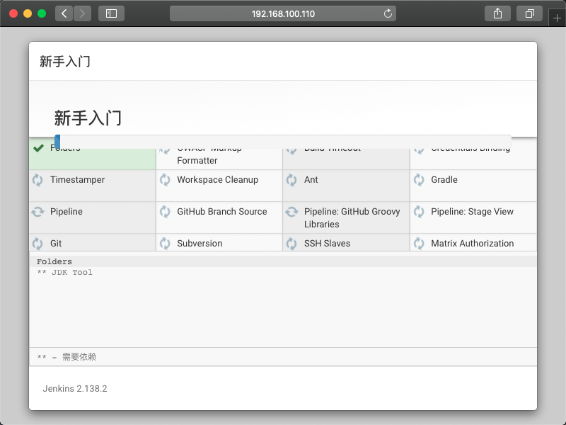

Jenkins 是一个开源软件项目，是基于Java开发的一种持续集成工具，用于监控持续重复的工作，旨在提供一个开放易用的软件平台，使软件的持续集成变成可能。

# 1 安装 Java

Jenkins 依赖于 Java， 所以需要[安装 JDK 环境](http://www.webupd8.org/2012/09/install-oracle-java-8-in-ubuntu-via-ppa.html)。

1. 增加 java 源（只能装 Java8 版本，其他版本 Jenkins 不支持）；

   ``` sh
   sudo add-apt-repository ppa:webupd8team/java
   sudo apt update
   ```

2. 安装 java 8；

   ``` sh
   sudo apt install oracle-java8-installer
   ```

   确认 License：

   

   

3. 安装 java 环境设置；

   ``` sh
   sudo apt install oracle-java8-set-default
   ```

4. 验证 java 版本 >= 1.8；

   ``` sh
   java -version
   ```

   出现以下结果：

   ``` sh
   java version "1.8.0_191"
   Java(TM) SE Runtime Environment (build 1.8.0_191-b12)
   Java HotSpot(TM) 64-Bit Server VM (build 25.191-b12, mixed mode)
   ```

5. 打开编辑以下文件，设置 java 环境；

   ``` sh
   sudo vi /etc/environment
   ```

6. 输入 Java 环境设置，保存并关闭文件；

   ``` sh
   JAVA_HOME="/usr/lib/jvm/java-8-oracle/"
   JRE_HOME="/usr/lib/jvm/java-8-oracle/jre/"
   ```

7. 更新环境设置；

   ``` sh
   source /etc/environment
   ```

# 2 安装 Jenkins

``` sh
# 1. 增加 Jenkins 源；
wget -q -O - https://pkg.jenkins.io/debian/jenkins-ci.org.key | sudo apt-key add -
sudo sh -c 'echo deb http://pkg.jenkins.io/debian-stable binary/ > /etc/apt/sources.list.d/jenkins.list'
sudo apt-get update

# 2. 安装 Jenkins；
sudo apt-get install jenkins
```

# 3 初始化 Jenkins

1. 修改 Jenkins 配置；

   ``` sh
   # 1. 创建工作路径（方便迁移管理）；
   sudo mkdir /data/jenkins
   sudo chown -R jenkins:jenkins /data/jenkins
   
   # 2. 打开编辑环境变量文件；
   sudo vi /etc/environment
   
   # 3. 配置 JENKINS_HOME 环境变量，并保存退出
   JENKINS_HOME="/data/jenkins"
   
   # 4. 更新配置；
   source /etc/environment
   
   # 5. 重启 Jenkins 服务；
   sudo service jenkins restart
   ```

2. 查看初始密码；

   ``` sh
   sudo cat $JENKINS_HOME/secrets/initialAdminPassword
   ```

3. 登录 Jenkins；

   打开浏览器，输入 `http://192.168.100.110:8080` 登录到 Jenkins，第一次登录需要初始密码。

   

4. 安装插件，选择`建议安装的插件`即可，选择后等待安装；

   

   

5. 创建Admin用户，点击保存并完成；

   

6. 实例配置，点击保存并完成；

   

7. 结束配置；

   

8. 进入 Jenkins；

   