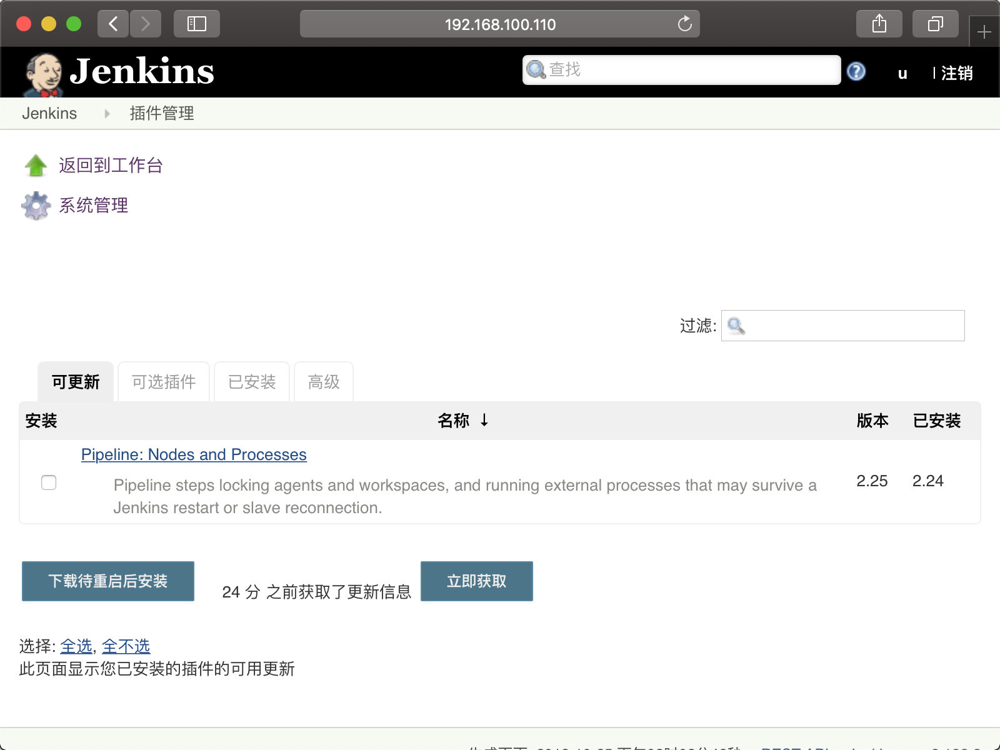
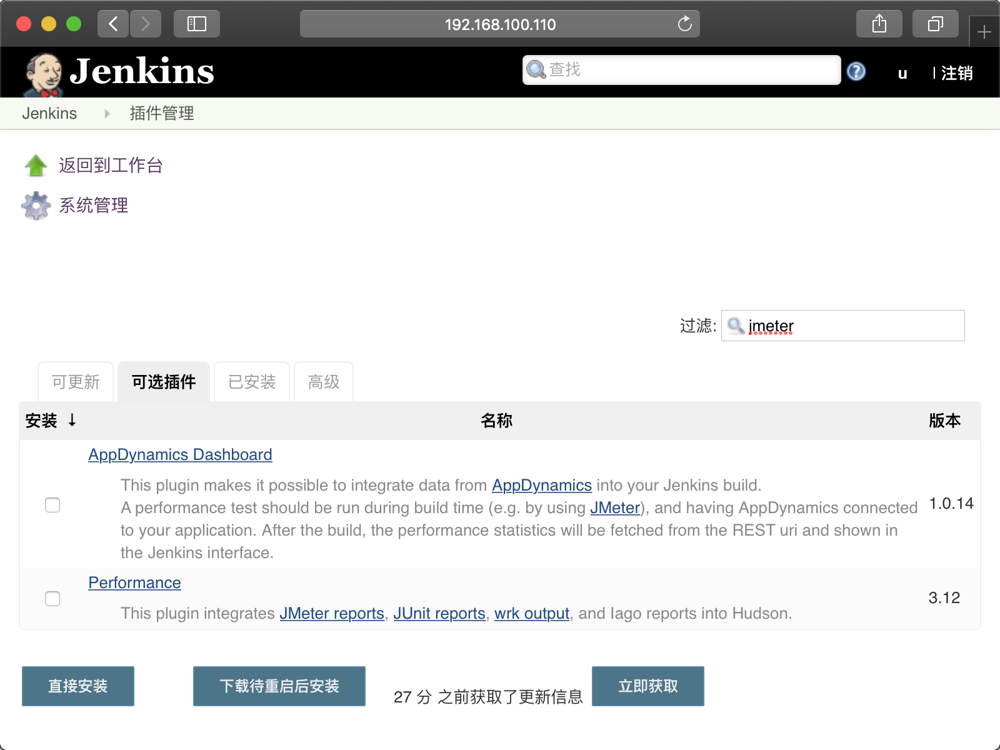
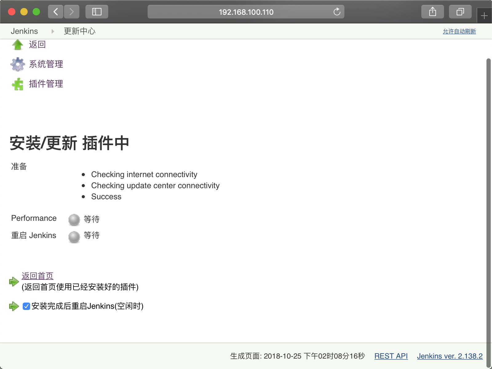
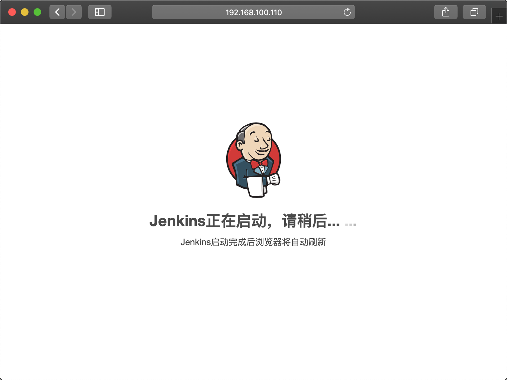
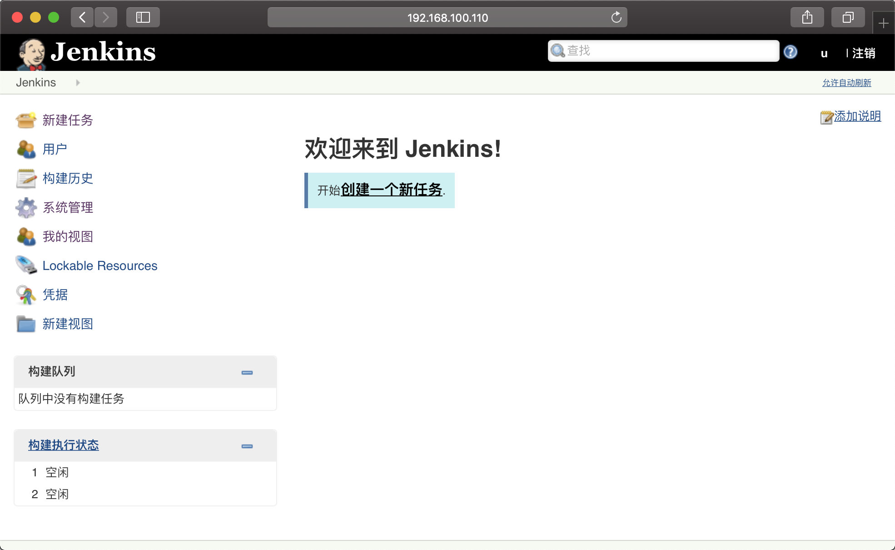
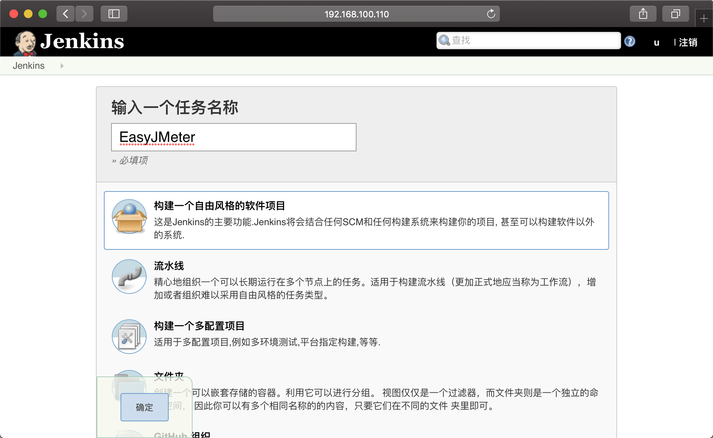
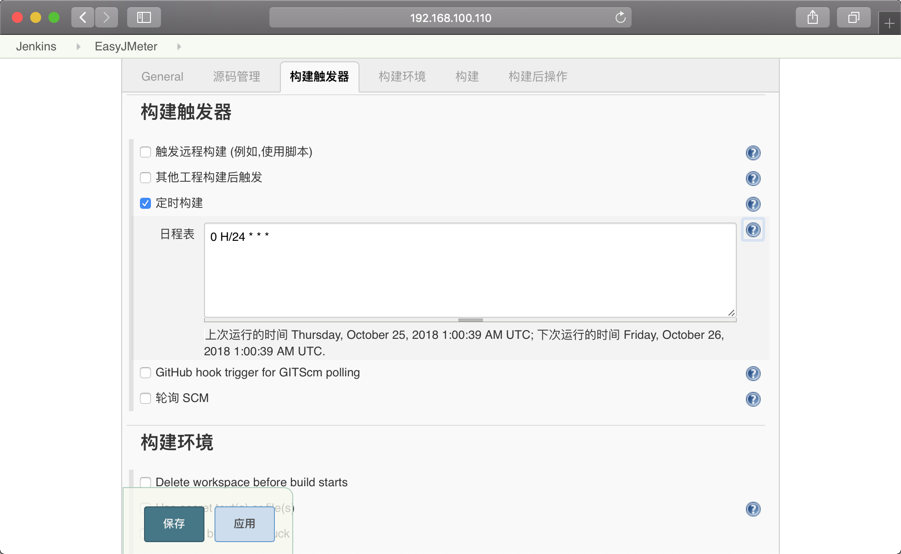
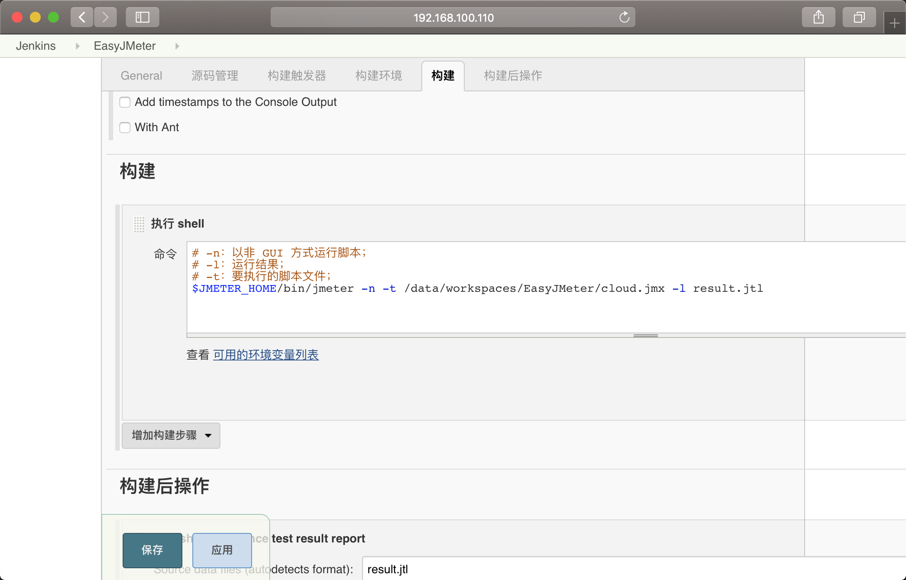
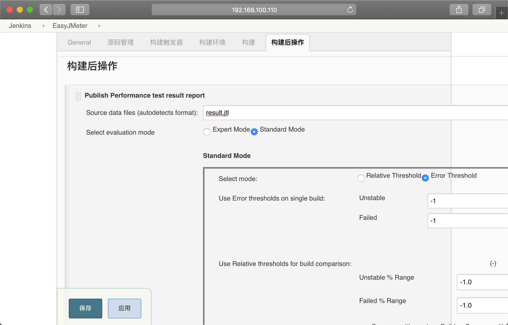
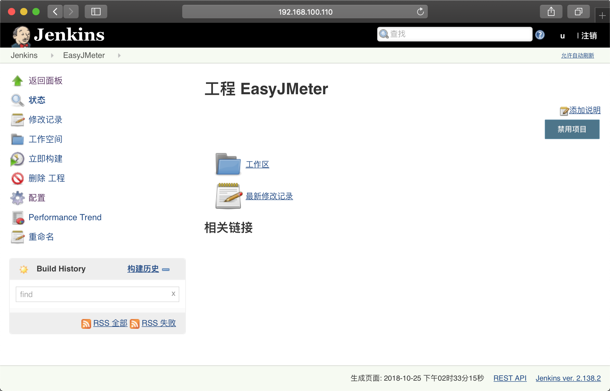

Apache JMeter 是 Apache 组织开发的基于 Java 的压力测试工具。用于对软件做压力测试，它最初被设计用于Web应用测试，但后来扩展到其他测试领域。

# 1 安装 JMeter

1. 下载 [JMeter](http://jmeter.apache.org/download_jmeter.cgi)；

   ``` sh
   cd ~
   wget http://mirrors.shu.edu.cn/apache//jmeter/binaries/apache-jmeter-5.0.tgz
   ```

2. 解压 JMeter 安装包；

   ``` sh
   tar xzvf apache-jmeter-5.0.tgz
   ```

3. 将 JMeter 安装包，放在 `/opt` 路径下；

   ``` sh
   sudo mv -u apache-jmeter-5.0 /opt/apache-jmeter-5.0
   ```

4. 打开环境变量文件，配置环境变量；

   ``` sh
   sudo vi /etc/environment
   ```

5. 配置内容，保存退出；

   ``` sh
   JMETER_HOME="/opt/apache-jmeter-5.0"
   PATH=$PATH:$JMETER_HOME/bin
   ```

6. 更新配置；

   ``` sh
   source /etc/environment
   ```

7. 验证 JMeter 安装成功；

   ``` sh
   jmeter -v
   
   # 输出以下内容表示安装成功：
   # Oct 25, 2018 1:52:22 PM java.util.prefs.FileSystemPreferences$1 run
   # INFO: Created user preferences directory.
   #     _    ____   _    ____ _   _ _____       _ __  __ _____ _____ _____ ____
   #    / \  |  _ \ / \  / ___| | | | ____|     | |  \/  | ____|_   _| ____|  _ \
   #   / _ \ | |_) / _ \| |   | |_| |  _|    _  | | |\/| |  _|   | | |  _| | |_) |
   #  / ___ \|  __/ ___ \ |___|  _  | |___  | |_| | |  | | |___  | | | |___|  _ <
   # /_/   \_\_| /_/   \_\____|_| |_|_____|  \___/|_|  |_|_____| |_| |_____|_| \_\ 5.0 r1840935
   
   # Copyright (c) 1999-2018 The Apache Software Foundation
   ```

# 2 配置 Jenkins

1. 安装 Performance 插件；

   * 打开 Jenkins，在【系统管理】中，找到【插件管理】；

     

   * 选择【可选插件】，在【过滤】中输入 `jmeter`；

     

   * 选择 `Performance`，并点击【直接安装】，在新的页面中，选择【安装完成后重启Jenkins(空闲时)】；

     

   * 安装完成后进入重启页面（如果没有自动刷新，请手动刷新页面）；

     

2. 创建 Jenkins 任务；

   

3. 输入任务名称，选择自由风格的软件项目，并确认；

   

4. 在【构建触发器】中，选择【定时构建】，指定为每天执行一次；

   

5. 在【构建】中，增加【执行 shell】步骤，并输入执行 JMeter 的命令；

   

6. 在【构建后操作】中，增加【Publish Performance test result report】步骤，输入上一步中输出的结果文件名，其他按照默认配置即可；

   

7. 点击【保存】；

   
