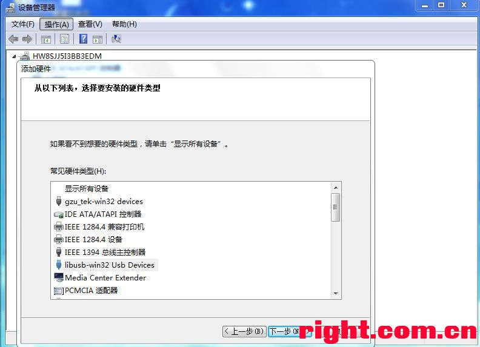
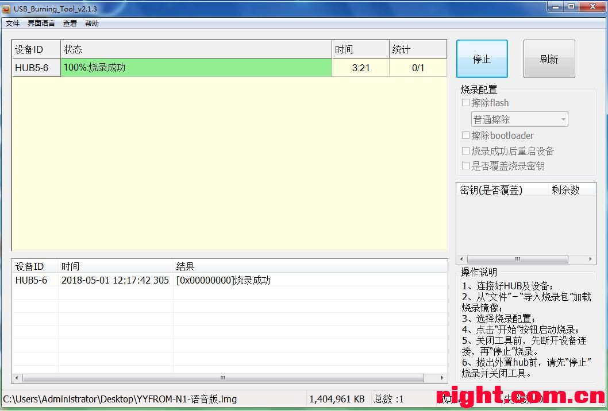

# 斐讯 N1 盒子刷机

现在市面上的各种盒子，广告很多，体验很差。618 入了一个明基投影仪，打算买一个盒子的前提下，刚好好多朋友推荐斐讯 N1 盒子，优点是性能很强大，价格便宜，刷机后非常给力。

所以从拼多多上入了一个 N1 盒子 + T1 原装遥控器 + 刷机线，总价 119.9 元（斐讯在淘宝/京东/咸鱼/拼多多上都已经被屏蔽，需要搜索 N1 盒子来查找）。

## 1 刷机准备

设备：

1. N1 盒子一台；
2. 刷机线一根；
3. 显示器一台；
4. 网线一根；
5. 鼠标一个；
6. Windows 电脑一台；
7. 网络环境；

工具：

1. 系统降级工具；
2. 进入线刷模式工具；
3. 刷机软件：UsbBurningTool；
4. 刷机系统 Rom；
5. 驱动人生；

## 2 系统降级

由于 N1 最新的系统固件，已经被加密，所以在不降级的前提下，无法进行刷机。

1. N1 连接显示器/网线/鼠标/电源，开机，进入以下界面；

   

2. 鼠标连续点击固件版本这行字，直到出现下方“打开adb”；

3. 连接刷机线，注意 N1 盒子是对应 HDMI 旁边 USB 口；

4. 在 Windows 上，打开驱动人生，打开外设驱动，安装安卓驱动；

   

5. 在 Windows 电脑上，解压 《N1-T1降刷机助手v1.1版本》压缩包；

6. 进入解压后的目录中，运行 `T1_N1降级工具v1.1.exe`；

   

5. 选择降级设备为 N1，设备 IP 为 N1 盒子对应的 IP，点击开始降级；
6. 没有意外的话，最终工作状态会显示为降级成功；
7. 断开 USB 和电源，重启 N1 盒子；
8. 重启后，进入初始界面，但是上面固件版本仍然为原来的版本，这个不要在意，因为刷机的固件版本，跟显示的这个固件版本，是两个东西，只要降级工具里面显示成功即可；

## 3 刷机

系统降级成功后，可以选择需要的 Rom 进行刷机，常见的 Rom 有很多，大家可以自行百度查找适合自己的 Rom，这里以常见的《斐讯盒子N1_YYFROM讯飞语音实用版190421》进行示例。

1. 连接刷机线；

2. 安装 UsbBurningTool，软件会自动安装 USB 驱动；

   

3. 打开 UsbBurningTool，在“文件”中加载刷机包，加载完成后，点击开始按钮（**注意擦除 FLASH 和擦除Bootloader 前面的对号要去掉**）；

   

4. 解压《使N1进入线刷模式》压缩包，双击运行 `reboot_to_usb_burn/进入线刷模式.bat` 脚本；

5. 这时候盒子会进入重启状态（如果显示器有内容显示，先不要管），对应 Windows 电脑会有 USB 设备插入的提示声；

6. XP 以上 Windows 系统，需要手动添加驱动；

7. 在我的电脑上右键，选择管理，并打开设备管理器，然后在操作中，添加过时硬件；

   

   

   

   

8. 驱动安装完成后，N1 进行断电重启；

9. 重启后，重新运行  `reboot_to_usb_burn/进入线刷模式.bat` 脚本；

10. 这时候，UsbBurningTool 可以识别到设备，并开始进行刷机；

    

11. 刷机完成后，关掉 UsbBurningTool，并断电重启 N1，之后可以进入刷机的系统；

    

## 4 参考地址

* [斐讯天天链N1刷机小白教程](https://www.right.com.cn/forum/thread-318044-1-1.html)
* [T1_N1一键降级工具v1.1版本](https://www.right.com.cn/forum/thread-336688-1-1.html)
* [其他工具(czez)](https://pan.baidu.com/s/11ll1an5qHuYKTIIotuRuwA)

